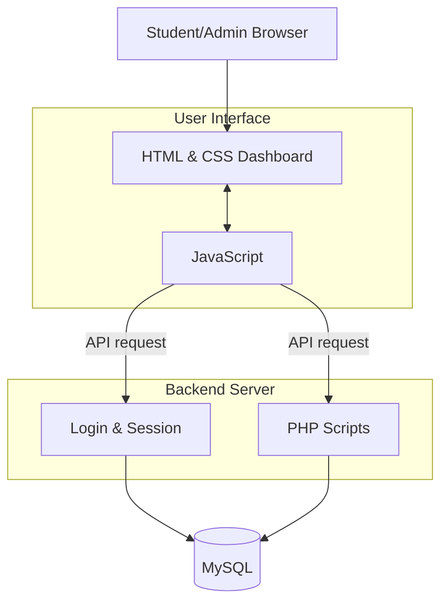
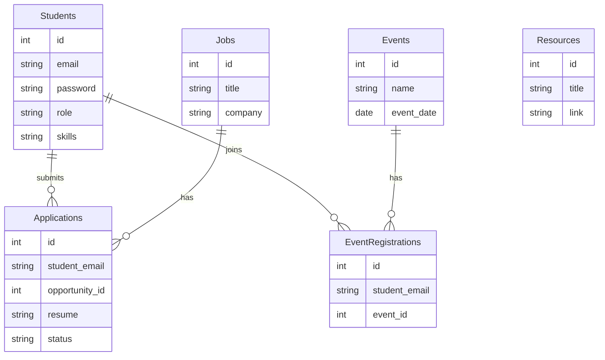
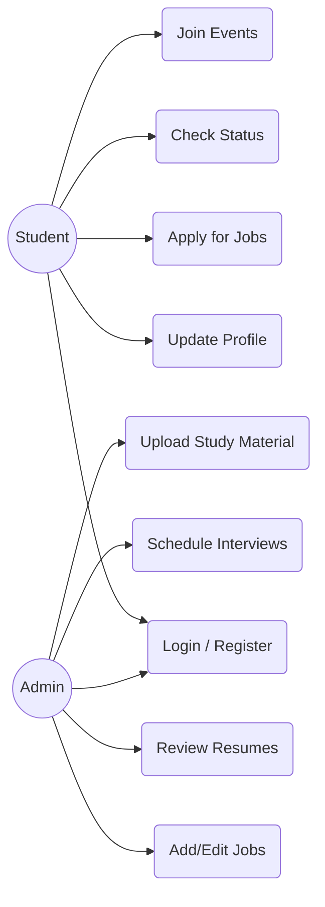
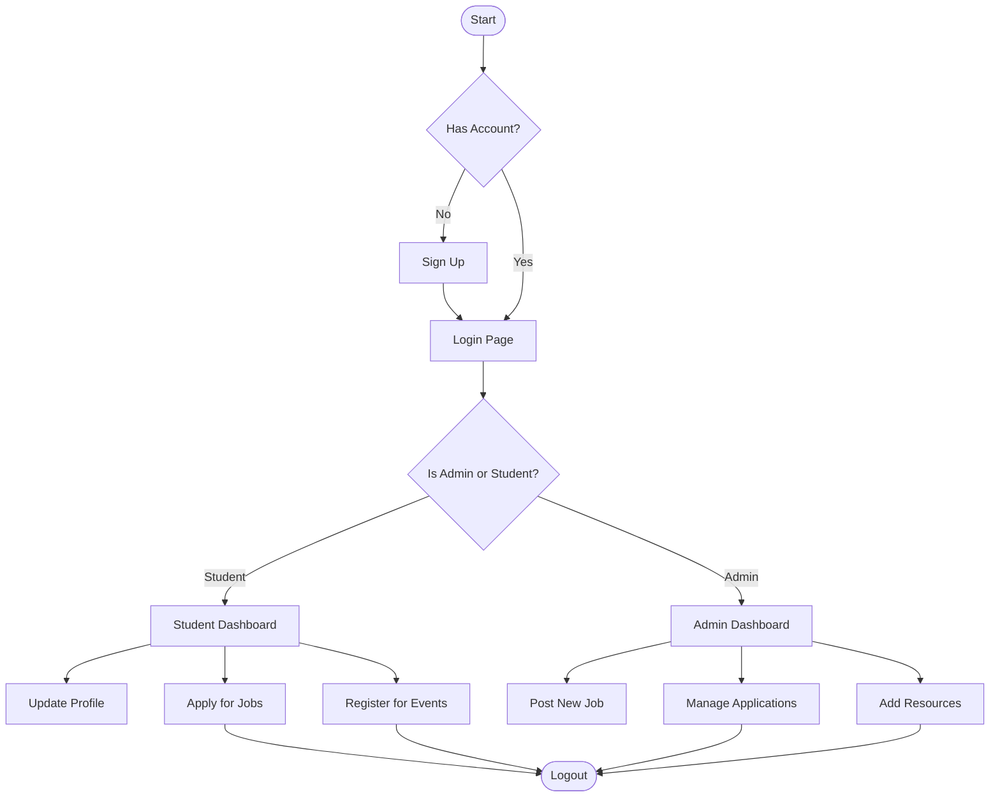

# PROJECT REPORT: Campus Resource & Opportunity Hub 

**Institution:** NIET Greater Noida (Autonomous Institute)
**Department:** Computer Science & Engineering

---

## DECLARATION
I/We hereby declare that the project entitled "Campus Resource & Opportunity Hub," submitted in partial fulfillment of the requirements for the degree of Bachelor of Technology in Computer Science & Engineering at NIET Greater Noida, is an authentic record of our own work carried out under the supervision of our assigned guide. The matter embodied in this report has not been submitted by me/us for the award of any other degree or diploma to any other University or Institute.

*(Signature of Student(s))*  
*(Name of Student(s))*  
*(Roll Number)*  

---

## CERTIFICATE
This is to certify that the project report entitled "Campus Resource & Opportunity Hub" is a bona fide record of the work carried out by [Student Names] under my/our supervision in partial fulfillment of the requirements for the award of the Degree of Bachelor of Technology in Computer Science & Engineering at NIET Greater Noida. 

*(Signature of Guide)*  
*(Name of Guide)*  
Designation, Department of CSE  

*(Signature of HOD)*  
*(Name of HOD)*  
Head of Department, CSE  

---

## ACKNOWLEDGEMENT
We would like to express our deep and sincere gratitude to our project guide for their continuous support, valuable guidance, and encouragement throughout the course of this project. We are also highly thankful to the Head of the Department, Computer Science & Engineering, NIET Greater Noida, for providing us with the necessary facilities and a conducive environment to complete this project successfully. Finally, we thank our institution, peers, and family for their unwavering support.

---

## ABSTRACT
The "Campus Resource & Opportunity Hub" is a comprehensive, centralized Software-as-a-Service (SaaS) web platform designed specifically to modernize and streamline campus placements, event coordination, and resource distribution. Traditionally, college placement cells and students face significant communication gaps. Job postings are often scattered across notice boards, disparate email chains, and disjointed messaging groups. The application tracking process is frequently handled manually via ad-hoc spreadsheets, resulting in data redundancy and a lack of transparency for the applying students.

To resolve these systemic inefficiencies, this project introduces a fully integrated portal serving two primary stakeholders: the Students and the Placement Administration (Admin). Developed utilizing a robust technology stack comprising HTML5, Vanilla CSS3, JavaScript, PHP, and a normalized MySQL database, the platform completely digitizes the recruitment lifecycle. Students are empowered with a dedicated dashboard to maintain their professional profiles (Skills, CGPA), securely upload resumes in PDF format, apply to active campus opportunities with a single click, and track their application status dynamically (e.g., 'Applied', 'Interview Scheduled', 'Selected').

Concurrently, administrators are provided with a powerful control center to post and manage job opportunities, schedule institutional events, share critical learning resources, and directly evaluate candidate pools. The system architectures emphasize real-time data handling through asynchronous JavaScript queries (`fetch()` API) communicating with modular PHP REST-like endpoints. Furthermore, the application features an extensively designed, card-based User Interface (UI) that is fully responsive and boasts a seamless high-contrast dark mode to ensure maximum usability and engagement across all devices.

---

## CHAPTER 1: INTRODUCTION

### 1.1 Overview
The modern educational landscape places a heavy emphasis on successfully transitioning students from academia into the professional workforce. The campus placement process is the crucial bridge that facilitates this transition. However, as student populations grow and the volume of recruiting companies increases, managing this ecosystem manually becomes an administrative bottleneck. 

The **Campus Resource & Opportunity Hub** is envisioned as an end-to-end digital ecosystem developed to eliminate these bottlenecks. Rather than relying on third-party generic job boards that lack college-specific context or legacy ERP systems that suffer from poor user experiences, this platform provides a bespoke, highly interactive environment. It not only centralizes all job and internship opportunities but also acts as a hub for academic upskilling by allowing the centralized sharing of reference materials and workshops.

### 1.2 Objective and Scope
**Objective:** 
The primary objective of the proposed system is to design, develop, and deploy a secure, highly responsive, and interactive web application that automates the workflow of the institutional placement cell while delivering complete transparency to the candidates.

**Scope of the Project:**
The scope of this project is localized to the parameters of a college ecosystem, guaranteeing secure segregation of data. 
- **For Candidates (Students):** 
  - Implementation of secure authentication and session management.
  - Profile customization including dynamic skill logging and academic tracking (CGPA).
  - A consolidated feed to browse active job listings spanning various domains.
  - Secure infrastructure to handle multi-part form data for uploading candidate resumes.
  - A real-time tracking interface to monitor their position within the recruitment pipeline.
  - The ability to subscribe and register for upcoming placement drives and tech seminars.
- **For Administrators (Placement Cell):** 
  - Comprehensive CRUD (Create, Read, Update, Delete) operations over Jobs and Events.
  - A unified dashboard to filter through candidate applications per job role.
  - Privileges to manipulate the status of a candidate's application and broadcast interview schedules.
  - Tools to broadcast critical learning links and materials directly to the student portal.

---

## CHAPTER 2: LITERATURE REVIEW

### 2.1 Overview of Existing Systems
The existing operational framework for campus placements generally falls into three categories:
1. **Manual or Semi-Digital Methods:** Heavy reliance on physical bulletin boards, word-of-mouth, or fragmented WhatsApp/Telegram groups. Data collection is often executed via rudimentary Google Forms.
2. **Third-Party Commercial Boards:** Platforms like LinkedIn or Internshala. While powerful, they are not strictly localized to a specific college's internal placement drives, making it difficult for the placement cell to track a student's institutional progress.
3. **Legacy College ERP Systems:** Many institutions deploy monolithic ERP software. These systems are notoriously rigid, suffer from outdated User Interfaces (UI), lack mobile responsiveness, and rarely support dedicated pipeline tracking.

### 2.2 Limitations of Existing Systems
An exhaustive analysis of the existing methodologies highlights several critical flaws:
- **Severe Lack of Centralization:** Students must constantly context-switch between emails, messaging apps, and forms to stay updated.
- **Administrative Overhead:** Placement officers spend countless hours manually sorting through Google Form spreadsheets and downloading individual resumes to organize candidate pools.
- **Zero Real-Time Tracking:** Candidates submit forms into a "black box" and have no mechanism to track if their resume was viewed, shortlisted, or rejected.
- **Data Redundancy & Integrity Issues:** Without a centralized relational database, the same student might register multiple times for the same drive, causing data anomalies.
- **Poor User Experience Design:** Legacy systems ignore modern design standards. They lack visual hierarchy, intuitive navigation, and accessibility features like Dark Mode.

---

## CHAPTER 3: REQUIREMENTS

### 3.1 Functional Requirements
Functional requirements define the specific actions the system must perform.
- **Role-Based Authentication:** The system must differentiate between 'Student' and 'Admin' roles upon login and redirect to distinctly routed dashboards.
- **Profile Maintenance:** The system must allow students to input and update their CGPA and tech skills to better align with job eligibilities.
- **Opportunity Lifecycle Management:** 
  - Admins must be able to generate detailed job posts (Title, Company, Salary, Location).
  - Students must be able to securely upload their `.pdf` resumes specifically tied to a given job ID.
- **Application Pipeline Modification:** Admins must possess the functionality to view all applicants for a job, download their resumes, and change their statuses (e.g., 'Selected', 'Under Review').
- **Event Mapping:** The system must prevent duplicate event registrations by a single user using composite database keys.
- **Resource Repository:** The system must offer a viewable list of categorised study links securely managed by the admin.

### 3.2 Non-Functional Requirements
Non-functional requirements specify the quality attributes and system constraints.
- **Robust Security:** 
  - Prevention against SQL Injection via strict backend querying.
  - Password hashing utilizing cryptographic functions (e.g., `password_hash()` in PHP).
  - Secure file handling to prevent malicious executable scripts from being uploaded to the server directory.
- **Usability & UX:** 
  - The UI must dynamically adapt to various viewpoints (Mobile, Tablet, Desktop) using CSS Media Queries.
  - High-contrast, completely integrated Dark Mode to reduce eye strain during prolonged usage.
- **Performance & Interactivity:** Minimizing full-page reloads. The application must invoke asynchronous logic (`fetch()`) to retrieve JSON payloads from the server instantly.
- **Data Integrity:** Strict enforcement of Referential Integrity at the database level utilizing `ON DELETE CASCADE` constraints (e.g., If an Admin deletes a 'Job', all mapped 'Applications' for that job must be systematically wiped).

### 3.3 Software and Hardware Requirements
**Software Requirements:**
- **Frontend Architecture:** HTML5 (Semantic Layouts), CSS3 (Flexbox/Grid, CSS Variables targeting Dark Mode), JavaScript (Vanilla ES6+).
- **Backend Architecture:** Core PHP 8+ (Handling routing, file I/O, business logic).
- **Database Engine:** MySQL Server (Relational architecture).
- **Server Environment:** Apache HTTP Server (Bundled within XAMPP).
- **Client Application:** Any modern, standards-compliant Web Browser (Chrome, Firefox, Safari).

**Hardware Requirements:**
- **Processor:** Dual-Core CPU (Minimum), Intel Core i3 / AMD Ryzen 3 or higher.
- **RAM:** Minimum 4 GB required for running the local Apache/MySQL stack.
- **Storage:** Minimum 256 MB of available disk space to maintain database schemas and house candidate resumes.

---

## CHAPTER 4: SYSTEM DESIGN AND IMPLEMENTATION

### 4.1 System Architecture (Flow diagram)
The application adheres to a modernized Client-Server Model implementing an API-driven design pattern. The frontend client operates entirely independent of the server's rendering sequence, merely relying on the PHP backend as a conduit to query or mutate the MySQL database.

### 4.2 ER Diagram (Entity Relationship)
The relational database structure (`schema.sql`) ensures deep referential integrity across all moving parts of the application. 

### 4.3 Use Case Diagram
The Use Case diagram demarcates the boundaries between the operational capabilities of the standard Candidate and the Placement Administrator.

### 4.4 Flowchart
The flowchart maps the logical navigational journey a user takes upon hitting the application's main entry point `index.html`.

### 4.5 Implementation Details
- **Frontend Assembly:** The core interface was written entirely from scratch using semantic HTML5 elements. All graphical presentation was handled via a strictly structured `style.css` file leveraging modern layout techniques (CSS Grid & Flexbox). CSS custom properties (variables) were utilized extensively to map color tokens, enabling the smooth toggle mechanism for Dark Mode. Interactivity, such as dynamically generating job cards on the UI and handling form submissions without refreshing, was scripted in `script.js`.
- **Backend Modular Endpoints:** Unlike traditional monolithic PHP applications where logic and HTML are deeply intertwined, this system parses backend tasks into lightweight, isolated execution scripts (`delete_event.php`, `apply.php`, `get_profile.php`). They validate session variables, sanitize `$_POST` injections, execute parameterized SQL bindings, and return pure JSON objects back to the browser.
- **File Systems Management:** Resume uploading is handled cautiously. The `apply.php` gateway strictly verifies the incoming file, executing PHP's `move_uploaded_file()` function to transfer the payload into an isolated `/uploads` directory, concurrently mapping the generated file path as a string within the MySQL specific `applications` table.

---

## CHAPTER 5: TESTING AND RESULTS

### 5.1 Testing Methodology
Software testing was strategically executed in three distinct phases:
1. **Unit Testing (Backend):** Each individual PHP script was executed directly with dummy payloads via standard HTTP clients (like Postman) to ensure accurate JSON configurations, testing both 'success' constraints and 'failure' catches (e.g., triggering constraint failures purposely).
2. **Integration Testing:** Ensuring the bridge between JavaScript `fetch()` calls and PHP scripts functioned harmoniously. A major focus was validating that file payloads appended to `FormData()` JS objects were seamlessly caught by the `$_FILES` PHP superglobal without data corruption.
3. **UI/UX & Responsiveness Testing:** Utilizing Google Chrome's Developer Tools to simulate various device form factors (e.g., iPhone 13, iPad Pro, 1080p monitors) to guarantee the CSS grid models collapsed correctly. The dark mode toggle was tested extensively to verify color inversion did not render elements illegible.

### 5.2 Test Cases And Results
The system passed rigorous qualitative test cases, ensuring robust reliability for live deployment:

| Test ID | Module | Feature Under Test | Expected Scenario Result | Actual Result | Status |
|---|---|---|---|---|---|
| TC_01 | Authentication | Attempt to login utilizing a non-existent email or invalid password string. | The PHP script should detect the discrepancy, deny session creation, and echo an "Invalid Credentials" JSON response. | Proper error string passed and rendered visually to the user. | **Pass** |
| TC_02 | Authentication | Admin-level Account Login. | The system logic identifies the 'admin' taxonomy within the session token and issues routing authorization to load `admin.html`. | Securely mapped and loaded the Administrator dashboard. | **Pass** |
| TC_03 | Candidate Interaction | Submitting an application for an existing Job whilst attaching a PDF Resume. | The physical `.pdf` is stored in `/uploads/`. The `applications` table inserts establishing FK linkages. | File securely parsed to the directory; DB updated successfully. | **Pass** |
| TC_04 | Administrator Logic | Admin alters a specific Candidate's status from 'Applied' to 'Interviewing'. | The MySQL `UPDATE` query modifies the row. When the candidate subsequently logs in, the JS immediately renders the new label. | Status actively transitioned and reflected seamlessly across both isolated UI portals. | **Pass** |
| TC_05 | Event Constraints | A candidate attempts a malicious duplicate Registration for the exact same Event. | Backend database logic enforces the `UNIQUE KEY` constraint mapped across Email + EventID, throwing a fatal error. | System structurally prevents the duplicate and returns a 'Already Enrolled' warning cleanly to the client. | **Pass** |

---

## CHAPTER 6: CONCLUSION AND FUTURE WORK

### 6.1 Conclusion
The **Campus Resource & Opportunity Hub** successfully achieves its objective of completely transitioning outmoded, manual college placement coordination into a highly interactive, digital, and transparent workflow. By developing a specialized UI decoupled effectively from a secure PHP backend and relational database, the overarching system provides immense operational velocity for institutional administrators. From the perspective of the students, the platform democratizes the application process. It abolishes the "black box" nature of applying by providing real-time tracking queues, centralizes critical academic study resources, and simplifies placement drive enrollments into a modern, unified SaaS product.

### 6.2 Future Work
While the current iteration of the system is functionally robust entirely suited for production, there is a tangible roadmap for expanding its capabilities:
- **Automated Communication Links:** Integrating enterprise SMTP server APIs to dispatch automated email or SMS notifications to candidates the nanosecond an interview timeline is scheduled or their application is rejected.
- **Machine Learning Resume Screening:** Connecting the backend with a Python/FastAPI microservice running Natural Language Processing (NLP) models. This would automatically parse unstructured PDF resumes and extract a quantifiable "Match Percentage" score against the required Job Description text to assist admins with pre-filtering.
- **Graduated Alumni Expansion:** Constructing a specialized third-tier User Role allowing successfully placed College Alumni to login, distribute corporate referral codes, host internal mentorship sessions, and create a localized college network.
- **PWA Deployment:** Transforming the codebase into a fully compliant Progressive Web App (PWA) incorporating a `manifest.json` and a Service Worker, allowing students to "install" the Hub natively onto their Android or iOS devices, pushing native operating-system notifications.

---

## REFERENCES
1. MDN Web Docs (Mozilla Developer Network). *Comprehensive guides on HTML5 semantics, flexbox/grid layout architectures, CSS Custom Properties, and Vanilla JavaScript (`fetch()` API, DOM traversal).* Retrieved from https://developer.mozilla.org/
2. PHP Official Documentation (php.net). *Technical reference regarding secure session management arrays (`$_SESSION`), multi-part `$_FILES` uploading buffers (`move_uploaded_file`), and raw `mysqli` connection strings.* Retrieved from https://www.php.net/manual/en/
3. MySQL 8.0 Reference Manual. *Guidelines referencing strict relational normalization models, maintaining Primary/Foreign Keys, and leveraging composite `ON DELETE CASCADE` triggers for table sanitization.* Retrieved from https://dev.mysql.com/doc/refman/8.0/en/
4. N.N. Group (Nielsen Norman). *Advanced Usability and Accessibility Guidelines, specifically concepts focusing on cognitive contrast mapping and responsive breakpoints essential for executing modern Dark Modes seamlessly.* Retrieved from https://www.nngroup.com/
